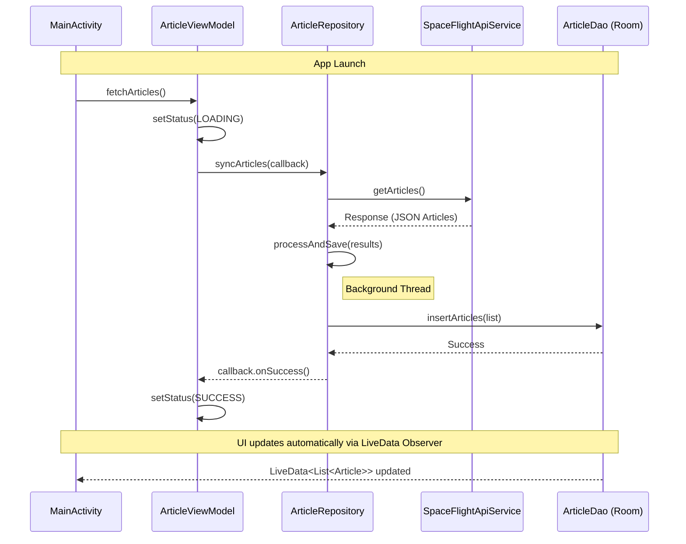
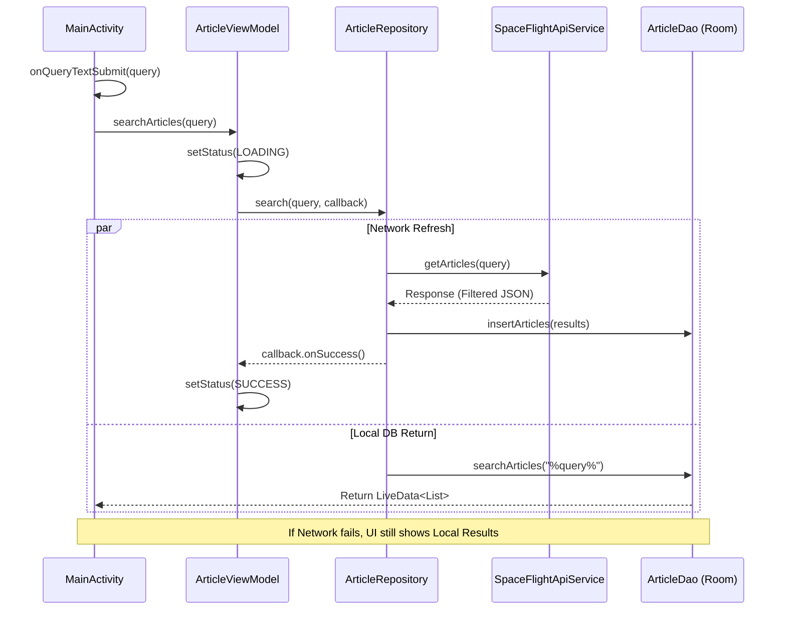
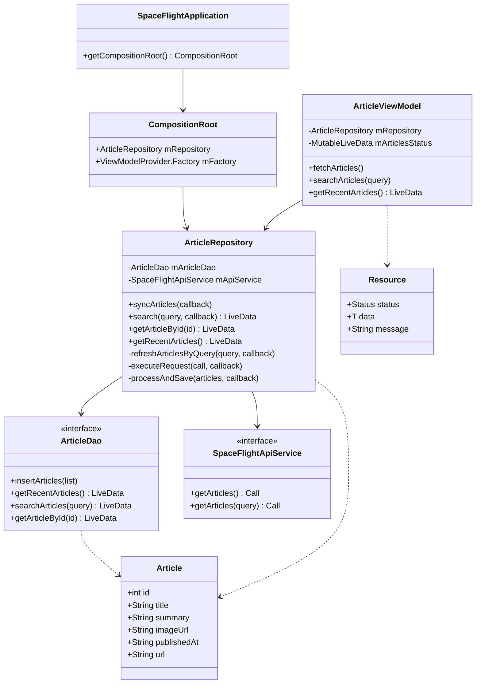

# Space Flight News App

An Android application designed to keep updated with the latest news from the space industry. This app utilizes the Space Flight News API to provide users with detailed information about spaceflight-related articles.

## Data flow diagrams

1. Initial data fetch (App Startup)

The following diagram illustrates how the application synchronizes with the API when it is first launched to ensure the local cache is up to date.

2. Search Query Execution

This diagram shows the parallel flow during a search: returning immediate local results for a better user experience while refreshing the data from the network.

## Class diagram
